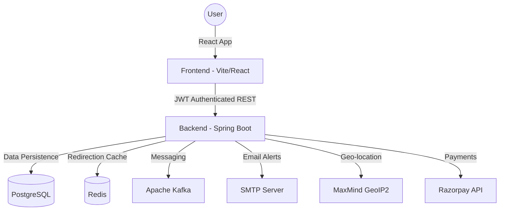

# 🔗 ShortenIt: Advanced URL Shortener & Analytics Platform

ShortenIt is a robust, full-stack enterprise-grade URL shortening solution designed for performance, security, and deep data insights. It empowers users to transform long, complex URLs into concise, branded links while capturing granular visitor analytics.

---

## 🏗 System Architecture

The platform follows a classic **Decoupled Client-Server Architecture**:



---

## 🌟 Comprehensive Features

### 👤 User Capabilities
- **Link Management**: Create, view, update, and delete shortened URLs (FREE users limited to 5 links, PRO users enjoy unlimited links).
- **Custom Aliases**: Define your own "short-code" for branded linking (e.g., `link.com/my-sale`).
- **QR Codes**: Automatically generated QR codes for every link, downloadable for offline marketing.
- **Social Sharing**: One-click sharing to WhatsApp, X (Twitter), Facebook, Threads, and Email with a custom, branded modal.
- **Lifecycle Control**: Set expiration dates or manually toggle links active/inactive with real-time cache invalidation.
- **Modern Auth**: Secure OTP-based password reset and "Magic Link" one-click login for seamless access.
- **Profile Management**: Update personal information, manage accounts, and track subscription status.

### 📊 Professional Analytics (Pro Plan Exclusive)
- **Real-time Tracking**: Monitor clicks as they happen.
- **Geographic Insights**: Identify where your audience is located (Country & City).
- **Technology Breakdown**: See which browsers and devices (Mobile/Desktop) users are using.
- **PDF Reporting**: Export professional, comprehensive analytics reports for individual links.

### 🛡 Administrative Features
- **Global Overview**: Unified dashboard to monitor every link with rich details (original URL, click count, status tracking).
- **Audit History**: Complete administrative log of all critical platform events and security actions, powered by Spring AOP.
- **User Governance**: View complete user profiles, and reliably activate, deactivate, or delete user accounts.
- **System Alerts**: Real-time notifications for automated background events (e.g., link expiry) via Kafka.
- **Data Export**: Perform client-side PDF exports for platform-wide link and user data for auditing.

---

## 🛠 Technology Stack

| Layer | Technology | Purpose |
| :--- | :--- | :--- |
| **Frontend** | React 18 | Declarative UI components |
| | TanStack Query | Server-state management & caching |
| | Tailwind CSS | Utility-first, premium styling |
| | Lucide React | Modern, consistent iconography |
| **Backend** | Spring Boot 3 | Robust REST API framework |
| | Spring Security | JWT-based Auth & Role-based access (RBAC) |
| | Hibernate/JPA | Object-Relational Mapping for PostgreSQL |
| **Storage** | PostgreSQL | Relational data persistence |
| | Redis | High-speed cache for URL redirections |
| | Apache Kafka | Event-driven notifications & background tasks |
| **Services** | Razorpay | Secure payment gateway for PRO plans |
| | MaxMind | Offline database for IP-to-Location mapping |

---

## 🚀 Step-by-Step Installation

### 1. Prerequisites
- **Java 17+**
- **Node.js 18+** & **npm**
- **PostgreSQL** (Running on port 5432)
- **Redis** (Running on port 6379)
- **Apache Kafka** (Zookeeper/Broker setup)

### 2. Backend Environment Setup
Create or update `backend/src/main/resources/application.yml`:

```yaml
spring:
  datasource:
    url: jdbc:postgresql://localhost:5432/urlshortener
    username: your_db_username
    password: your_db_password
  mail:
    host: smtp.gmail.com # or your provider
    username: your_email@gmail.com
    password: your_app_password
razorpay:
  key-id: your_razorpay_id
  key-secret: your_razorpay_secret
```

### 3. Run the Backend
```bash
cd backend
./mvnw clean install
./mvnw spring-boot:run
```

### 4. Run the Frontend
```bash
cd frontend
npm install
npm run dev
```
The application will be available at `http://localhost:5173`.

---

## 🔐 API Reference Overview

| Endpoint | Method | Description |
| :--- | :--- | :--- |
| `/api/auth/login` | POST | Authenticate and receive JWT |
| `/api/auth/register` | POST | Create a new user account |
| `/api/links` | POST | Create a new shortened link |
| `/api/links/{id}` | PUT | Update existing link details |
| `/api/analytics/link/{id}` | GET | Fetch detailed analytics for a link |
| `/api/payments/verify` | POST | Verify payment for PRO subscription |

---

## 📅 Subscription Logic
- **FREE Plan**: Default. Restricted to 5 links. No PDF exports.
- **PRO Plan**: Unlimited links. Full analytics access. Individual PDF reports enabled.
- **Expiration**: PRO status is valid for **365 days** from the payment date. The system automatically reverts users to FREE upon expiry.

---

## 📜 License
*Copyright © 2026. All rights reserved.*
